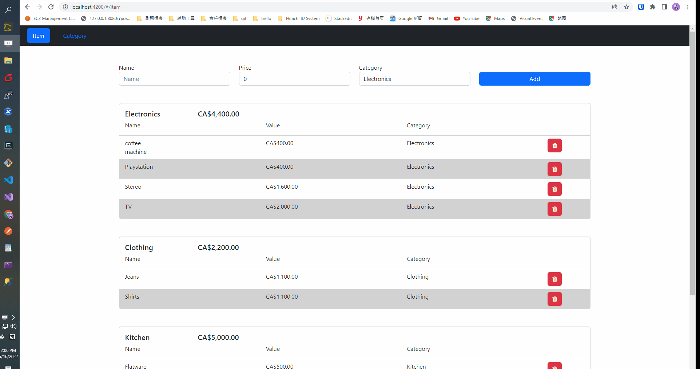

1. System Structure:
   Angular + ASP.NET CORE API

2. Realize Functions:
   ⦁ Build/Run with VS 2019 or the dotnet CLI and properly render in Chrome latest ✔
   ⦁ Allow a user to add an item with the following fields: ✔
   ⦁ Name (text input) ✔
   ⦁ Value (numeric input) ✔
   ⦁ Category (dropdown) ✔
   ⦁ This can be a static list using anything you want. Adding/deleting/renaming of categories is not required. ✔
   ⦁ Allow a user to remove an item from the list ✔
   ⦁ Display all items the user has added in a list, sorted by category ✔
   ⦁ Display the summed value of all items belonging to a category ✔
   ⦁ Display the summed value of all the items on the list ✔

⦁ Persist the data to a data store (SQL, NO-SQL, Localdb, anything is fine) ✔
⦁ Restore the data when the application is restarted ✔

